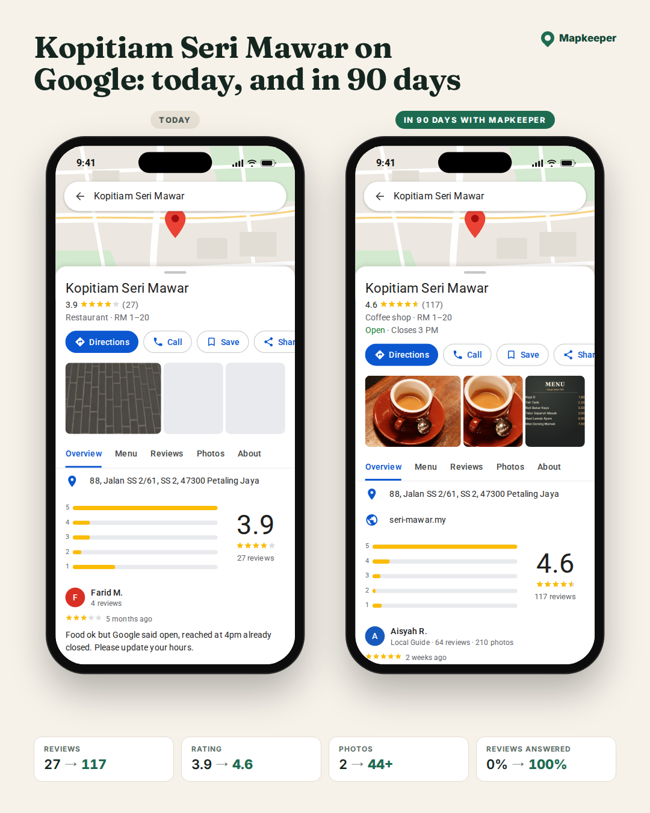
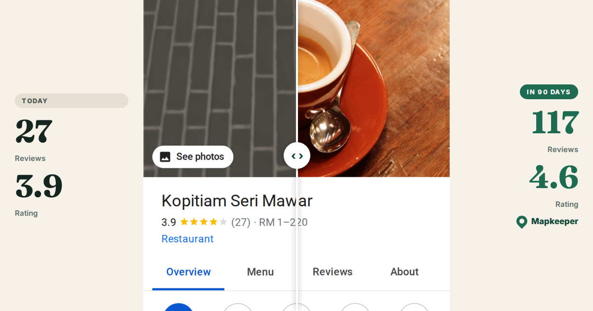

# NeoSEO (working title; customer brand proposed: Mapkeeper)

This repo holds the implementation plan and starter assets for an AI-run service that manages Google Business Profiles for independent local businesses.

**The offer:** we show each owner their Google profile today next to how it will look in 90 days with us: more reviews, a higher rating, real photos and fresh posts. Then, for $99/month in the US or RM199/month in Malaysia, we make it happen. AI agents do the work; the founder approves and handles exceptions.

**Start here:** [docs/00-summary.md](docs/00-summary.md)

| Visual 5 | Visual 9 |
|---|---|
|  |  |

## What's inside

| Area | Files |
|---|---|
| Plan | [docs/](docs/): summary, research, positioning, offering, outbound engine, fulfillment, AI operating model, website, roadmap and budget |
| Warm pipeline bot | [tools/pipeline/](tools/pipeline/): Google Maps scan, qualification, tailored proposals written by Claude Code, visuals 5 and 9, ranked call sheet |
| Sales process | [docs/11-sales-playbook.md](docs/11-sales-playbook.md) and [outreach/messages/](outreach/messages/) (WhatsApp EN/BM/中文, US text and email) |
| Profile visuals and audit page | [tools/audit-visual/](tools/audit-visual/): Google-style "today vs. in 90 days" panels, real-screenshot capture, comparison image, email card, audit page (English, Malay, Chinese, French; 11 layouts in [docs/visual-options/](docs/visual-options/)) |
| Email | [outreach/email/](outreach/email/): 4-step sequence (English and French) and reply playbook |
| Voice (Bland) | [outreach/voice/](outreach/voice/): persona, call flows (outbound first call, follow-up, inbound, onboarding, check-in), API payload, post-call schema |
| Agent playbooks | [.claude/skills/](.claude/skills/): `warm-pipeline`, `gbp-audit`, `outreach-email`, `reply-triage`, `review-reply`, `monthly-report` |
| Config | [config/markets.yaml](config/markets.yaml) (calling hours, caps, prices, languages per market), [config/targets.yaml](config/targets.yaml) (searches for the pipeline), [config/lead.schema.json](config/lead.schema.json) |

## Quick start

```bash
cd tools/audit-visual && npm install && npm test && npm run sample
cd ../pipeline && npm install && npm test && npm run demo   # offline warm-pipeline run on fixtures
```

For a real run, open Claude Code in this repo and say "run the warm pipeline" (see [tools/pipeline/README.md](tools/pipeline/README.md)).

## How it sells

1. **Show the potential.** Each prospect sees their real profile next to the profile they could have in 90 days.
2. **Two channels working together.**
   - **Bland** calls prospects directly and follows up on engagement.
   - **Email (US) or WhatsApp (Malaysia)** carries the visual and the audit page.
3. **Portable by design.** Playbooks are `SKILL.md` files, calls go through one API module, and the lead store mirrors to a Google Sheet. That makes a later move to Meta's Muse, or any other agent, a configuration change.
