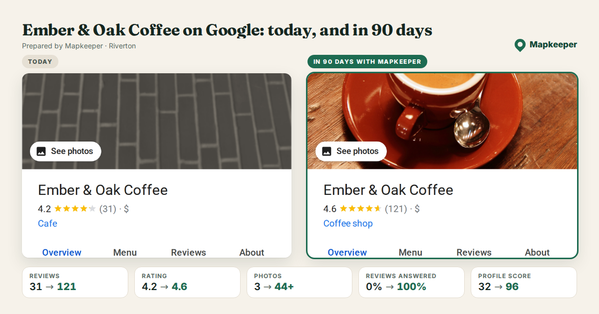

# Executive summary

**Status:** plan v2, 2026-09-26. Built on the research in [01-research.md](01-research.md). Prices tagged *unverified* there need a check before you commit money.

## The business in one paragraph

A productized, done-for-you Google Business Profile (GBP) service for independent local businesses.

- **Price:** about **$99/month in the US**, or about 69 € HT in France. That sits between DIY software ($30-60) and human agencies ($125-700+).
- **How it sells:** we show each owner their profile today next to their profile in 90 days, with more reviews, a higher rating, real photos, fresh posts and a complete listing.
- **How it's delivered:** the pitch goes out by email with the visual, and Bland AI calls prospects directly. AI agents do the prospecting, audits, calls, inbox, fulfillment and reporting. You approve and handle exceptions for about 5-15 hours a week.

Full comparison: [assets/sample-comparison-en.png](assets/sample-comparison-en.png). Audit page: [assets/sample-audit-page.png](assets/sample-audit-page.png).

## Strategic calls in this plan

1. **Proof by visual, pushed by voice.**
   - Every prospect gets their own before/after: the real profile today, next to the 90-day version.
   - Email delivers it. Bland calls to walk the owner through it and ask for the yes.
   - Calls go to leads marked `prior_approval`, with the approval obtained by you.
2. **Make claimed-but-neglected profiles the primary segment. Unclaimed profiles are secondary.**
   - Established businesses with 15-150 reviews and a clear gap to the businesses shown next to them buy faster.
   - Unclaimed owners must verify with Google themselves, often by video, and deals stall there. Use "we'll help you claim it" as the entry offer for that segment.
3. **Sell the levers that move rankings.**
   - **What works:** primary category choice, a steady flow of reviews, and a complete profile (services, hours, website).
   - **What doesn't:** keywords in the business name get profiles suspended. Posting frequency and keywords in descriptions showed no ranking effect in controlled tests.
   - **How we use updates:** about 4 posts a month, because they help people choose you, not because they move rankings.
4. **The review kit is the physical hook.** A counter stand with NFC and QR, take-home cards, and a follow-up text after each visit, all pointing to our short link. That link sends customers straight to the Google review form.
5. **The value is accountability, not posting.**
   - Semrush Local's $30 plan includes an AI agent for Google profiles, and Google itself is testing AI review replies.
   - What owners pay for:
     - someone who owns the result;
     - the review engine;
     - protection against bad edits and suspensions;
     - honest reporting on calls and directions.
   - **The 2026 hook.** Google's Ask Maps answers "best X near me" from profiles and reviews. It's live in the US.
6. **Muse (Meta's personal agent, launched 2026-09-08) fits later as your operator console, not as the campaign engine.**
   - Bland publishes setup docs for Muse, but Muse's phone plan is one call at a time and 500 a day.
   - The repo is built so switching is a configuration change: skill files, one call module, and a Sheet mirror of the lead list.

## Recommendations

| Decision | Recommendation | Why |
|---|---|---|
| First market | **United States**, English | Highest prices, Ask Maps is live, Bland is strongest in English, and the market is the largest |
| Second market | **France**, or **Malaysia** if you have a local presence there | See the market table in [02](02-positioning-and-brand.md). Malaysia has much lower prices and English-language calls work. |
| Verticals to pilot | **Auto repair** + **salons/barbers** or **cafés and restaurants** | Walk-in customers (the kit works), trust-driven choices, "near me" searches |
| Name | **Mapkeeper** (alternatives: Mapfront, Wellpinned) | Says what we do, frames the subscription, and is easy to say on a call. "SEO" is the word small-business owners associate with spam calls. |
| Price | Keep $99/mo, Grow $179/mo, setup $149 (waived for the first 25 clients) | Above DIY software, below human agencies, month to month |
| Sales channels | Email (visual + audit page) + Bland calls (first call, follow-ups, walkthrough and close) | The visual earns attention; the call converts it |
| Fulfillment | Localo Pro or a similar white-label tool first, then our own GBP API integration once Google approves access | API approval reportedly needs a verified profile active for 60+ days, so apply now |
| Orchestration | Self-hosted n8n + Claude API + the skills in this repo | Cheap, portable, compatible with Muse |

## What you need to decide or do

1. **Confirm the market and verticals.** Pricing, calling hours and language follow from this (`config/markets.yaml`).
2. **Pick the name.** Run trademark searches and buy the domains. My search quota ran out before I could check trademarks.
3. **Set up the business basics:** legal entity, Stripe account and business bank account.
4. **Create and verify a GBP for the agency itself,** then apply for GBP API access.
5. **Set up Bland.**
   - Start plan to build the flows; Build plan ($299/mo) once you pass 100 calls a day.
   - Buy local numbers in each market you call.
   - Keep your call-approval records on file. Bland's terms tie outbound calling to consent, and your approvals are what cover it.
6. **Approve the budget** in [08-roadmap-budget-kpis.md](08-roadmap-budget-kpis.md): about $3-5k over the first 3 months, most of the increase being Bland minutes.

## Map of this repo

| Path | What it is |
|---|---|
| [docs/01-research.md](01-research.md) | Research with sources and confidence levels |
| [docs/02-positioning-and-brand.md](02-positioning-and-brand.md) | Markets (including Malaysia), ideal customer, positioning, names, messaging |
| [docs/03-service-offering.md](03-service-offering.md) | Plans, deliverables, review kit, pricing, unit economics |
| [docs/04-outbound-engine.md](04-outbound-engine.md) | Lead sourcing, scoring, visuals, email + Bland sequence, infrastructure, funnel |
| [docs/05-fulfillment.md](05-fulfillment.md) | Onboarding, monthly operations, review engine, reporting |
| [docs/06-ai-operating-model.md](06-ai-operating-model.md) | Every function mapped to an agent and a human checkpoint; Muse compatibility |
| [docs/07-website.md](07-website.md) | Sitemap, page copy, stack, audit page |
| [docs/08-roadmap-budget-kpis.md](08-roadmap-budget-kpis.md) | Phases, budget, KPIs, kill criteria |
| [tools/audit-visual/](../tools/audit-visual/) | Google-style before/after panels, real-screenshot capture, comparison image, email card, audit page |
| [outreach/email/](../outreach/email/) | Sequences (EN, FR) and reply playbook |
| [outreach/voice/](../outreach/voice/) | Bland persona, call flows, API payload, post-call schema |
| [.claude/skills/](../.claude/skills/) | Agent playbooks as `SKILL.md` |
| [config/](../config/) | Market settings and the lead schema |
