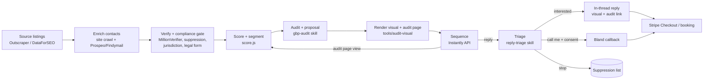

# Outbound engine

**Principle:** the edge is **proof, not persistence**. Every prospect sees their own profile fixed, specifically and correctly, before we ask for anything. AI makes that proof cheap enough to produce for thousands of businesses a month.

## 1. Lead sourcing

- **Where:** one vertical × one metro area per batch. Start with cities of 100k-1M people, where profiles are neglected and competition is moderate.
- **Primary source: Outscraper Google Maps.**
  - Fields: `verified`, `rating`, `reviews`, `photos_count`, categories, website, hours, posts.
  - Cost: about $3 per 1,000, plus Emails & Contacts at about $3 per 1,000 [S].
- **Alternative: DataForSEO Business Data.**
  - Fields: `is_claimed`, `total_photos`, reviews with `owner_answer`, Updates [V].
  - Useful for deeper audits of shortlisted leads.
- **Competitors:** for each lead, take the 3 businesses ranking above it for its main query in the same area. They become the benchmark for the review gap.
- **Terms of service:** both providers scrape Google, so the exposure under Google's terms sits mainly with them.
  - We use only public business data and store the minimum.
  - We don't republish reviewers' names or photos.
  - Google Places API data isn't used for the lead database, because its terms forbid that.

## 2. Contact enrichment (waterfall)

1. **Crawl the business website** with the LLM: About and Contact pages, and the footer. Extract the owner's name, role email and any published contact.
2. **Outscraper Emails & Contacts.**
3. **Fill gaps with Prospeo or Findymail** (charged only for verified results).
4. **Verify with MillionVerifier.** Send only to addresses marked "ok"; drop "catch-all", unless the address came from the business's own site.
5. **Check the line type with Twilio Lookup** (about $0.008 per number) for any phone number, even though we won't cold call it. This keeps the CRM honest about which numbers are mobiles.

## 3. Compliance gate (runs before any send; code spec in `config/compliance.yaml`)

A lead is dropped or held if any of these is true:

- **Suppression:** it's on the do-not-contact list (email, domain, phone or place ID). The list is shared across all channels and never expires.
- **Country rules:**
  - Germany: skip.
  - UK: skip unless the legal form is a limited company or LLP. Sole traders need consent.
  - Canada: skip for now.
  - France: the offer must relate to their profession (it always does). Use professional addresses, and include the notice required by GDPR Art. 14.
- **US state rules:**
  - California: no automated calls, ever, without a natural-voice opener.
  - Washington: no automated calls.
- **Business status:** permanently closed, or the category is excluded (medical at pilot stage).
- **Data quality:** the email is a personal Gmail with no business evidence on the website. This rule is stricter than the law requires, to protect deliverability and reputation.

**Every email includes:**
- the real sender name and company;
- a postal address;
- a one-line opt-out ("Reply 'stop' and I'll never email again"), plus a List-Unsubscribe header;
- for France: one sentence saying where the data came from, plus a link to the privacy notice.

## 4. Scoring and segmentation

`tools/audit-visual/src/score.js` computes:
- a **Profile Health Score** from 0 to 100 (13 weighted checks);
- a **lead priority**: the size of the gap, whether we can contact them, and whether they're an established business.

**Segment rules:**
- `is_claimed == false` → **Unclaimed**
- review count below 60% of the competitor median, and fewer than 5 reviews in 90 days → **Behind on reviews**
- otherwise, a health score under 60 → **Neglected**
- a score of 75 or more → **skip** (they don't need us, and the pitch would be weak)

## 5. The audit (the product before the product)

**Per lead, the `gbp-audit` skill produces the prospect JSON** in the renderer's input format:

- **Facts:** listing data, the score and findings, competitors.
- **Proposal:**
  - primary and secondary categories;
  - a 750-character description;
  - services;
  - a photo shot list;
  - 4 update ideas;
  - a draft reply to their latest review. Only the review text is used; the reviewer's name is never shown.

**The renderer then produces:**
- `card.png`: the before/after visual;
- `index.html`: the audit page;
- `audit.json`: the facts that emails and calls quote.

This keeps every channel consistent.

**Honesty rules**, enforced in code (see the tests):
- The "after" score changes only what setup controls. Rating, review count and review recency are never changed.
- No Google logos or copies of Google's interface. Every visual and page is labeled as an illustration and "not affiliated with Google".

**Quality control:**
- A human reviews 100% of the first 50 audits, then 10% at random, plus every lead the model marks as "low confidence".
- Common failure modes to check: a wrong category suggestion, and describing services the business doesn't offer.

Sample output: [assets/sample-card-en.png](assets/sample-card-en.png), [assets/sample-audit-page.png](assets/sample-audit-page.png).

## 6. The sequence (full copy in `outreach/email/`)

**Deliverability comes first.**
- The first email is plain text with no link and no image.
- The visual arrives either inside the thread after a reply, or on our branded audit page, with one link in email 2.

| Step | Day | Content | Link? |
|---|---|---|---|
| 1 | 0 | 3 specific findings from `audit.json`, then "I mocked up your profile fixed. Want me to send it over?" | No |
| 2 | 3 | "Here it is anyway": one line plus the audit page link | 1 (branded domain) |
| 3 | 7 | Segment angle: the review gap against named competitors, or Ask Maps, or "anyone can edit your listing" | No |
| 4 | 14 | Close the loop: "Should I delete your audit?" | No |

**Rules:**
- under 80 words per email;
- no open tracking;
- a custom tracking domain for the one link;
- sending from secondary domains only, never from our main domain.

**Personalization depth:**
- every email uses the business's own numbers and competitor names;
- the model writes one tailored sentence per email, within strict templates.

**Signals:**
- **Audit page viewed** (logged on our server): move the lead to the front of the queue, and send email 3 sooner. Never mention that they viewed it.
- **Two or more views, or a click on the checkout button without paying:** create a task for you to send a short personal video or email.

## 7. Reply handling (the `reply-triage` skill)

**Classification** (Haiku 4.5, with a strict output schema):
- interested
- question
- price question
- call me
- not now
- not interested
- unsubscribe
- wrong person
- out of office
- is this a scam / is this Google

**Actions:**
- **Unsubscribe or not interested:** suppress immediately, with no reply (or a one-line confirmation where the law requires it).
- **Interested or question:** a Sonnet draft replies in the thread with the inline card image, the audit link, and the price with the checkout link. **You approve** drafts until 50 have been approved without edits; after that they send automatically, and only exceptions come to you.
- **Call me:** reply with a 2-field consent form: number, plus a checkbox reading *"Mapkeeper may call me about my request, including with an AI assistant. I can opt out anytime."* A Bland callback is scheduled only after the form is submitted, and within business hours.
- **Scam or Google question:** a standard, honest answer (who we are, not Google, the founder's name, a link to the public pricing page, "you don't have to reply").

## 8. Voice (Bland): where it's used

**No AI cold calls.** Voice starts only after consent, inbound contact, or an existing client relationship. Specs are in `outreach/voice/`.

| Flow | Trigger | Legal basis |
|---|---|---|
| **Callback walkthrough** | Consent form submitted | Prior express written consent, with the form wording reviewed by a lawyer |
| **Inbound line** | Prospect or client calls the number in our emails or on the site | Inbound call |
| **Onboarding verification coach** | New client, scheduled by them | Customer relationship + the booking |
| **Client check-in** (day 30, day 90, before renewal) | Existing client | Customer relationship + consent in the terms |

**Every call:**
- starts by saying "Mapkeeper's AI assistant" and giving the reason for the call;
- includes a recording notice;
- has an opt-out tool that writes to the suppression list;
- can warm-transfer to you for pricing exceptions or complaints.

**Plan:**
- The Start plan ($0/month, $0.14/min) is enough at pilot volume (100 calls a day).
- Estimated cost: 60 calls a month × 4 minutes ≈ $35.

### Optional: human calls

In France, and to verified US business landlines, a human (you or a virtual assistant) calling after email 2 is lawful with the right safeguards:
- US: exclude California and Washington, keep an internal do-not-call list, identify yourself;
- France: B2B calling hours.

Test it only if the email numbers stall.

### Optional: direct mail

For top-priority leads with no email address, a postcard with the before/after card and a QR code to the audit page. At about $0.70-1.50 per card via a print-and-mail API (Lob or similar; pricing unverified), it's lawful everywhere, arrives with no deliverability problems, and matches the visual idea perfectly.

**Test:** 200 cards in month 2.

## 9. Infrastructure and volume

| Volume | Inboxes | Domains | Sending platform | Stack cost/month |
|---|---|---|---|---|
| Pilot: 250-500 prospects a week | 15 | 5 | Instantly Hypergrowth ($97) or Smartlead Pro ($94) | ~$300 |
| Scale: 1,000 prospects a week | 30 | 10 | Same | ~$600 |

**Mailbox setup:**
- Mailboxes from Zapmail or Premium Inboxes (Google), plus a Microsoft provider for redundancy, at about $3-3.50 per inbox.
- SPF, DKIM and DMARC (`p=none`, then `quarantine`) on every domain.
- 3 inboxes per domain, 25 cold emails per inbox per day after a 3-week warmup.

**Domains:**
- secondary domains that look like the main brand (`getmapkeeper.com`, `mapkeeperhq.com`, `trymapkeeper.com`, and so on);
- each redirects to the main site.

**Monitoring** (weekly, automated):

| Metric | Threshold |
|---|---|
| Bounce rate | under 2% |
| Spam complaints | under 0.1% |
| Reply rate per inbox | watch for drops |
| Placement tests | 1 per week |

A domain that crosses a threshold is paused automatically.

## 10. Funnel model (assumptions to validate in the pilot)

| Stage | Assumption | Per 1,000 prospects |
|---|---|---|
| Delivered | 97% | 970 |
| Any reply | 3% (Instantly's 2026 average; no local-business benchmark found) | 29 |
| Positive reply or audit engagement | 1.2% | 12 |
| Close (checkout) | 25% of positive | 3 |
| **New clients** | | **~3 per 1,000** |

**What that means:**
- At 1,000 prospects a week: about 12-13 new clients a month, adding roughly $1,200-1,300 of monthly recurring revenue each month.
- Variable cost per client won: about $600/month stack ÷ 12.5 ≈ **$48**, plus your time.

This is comfortably below the $300 target, so the model can absorb a close rate half as good.

**Kill or adjust:** see [08-roadmap-budget-kpis.md](08-roadmap-budget-kpis.md).
