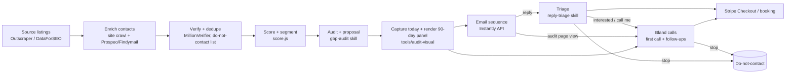

# Outbound engine

**Principle:** show every owner the profile they could have, then call them about it. The visual earns attention and the call converts it. AI makes both cheap enough to run for thousands of businesses a month.

## 1. Lead sourcing

- **Batches:** one vertical × one metro area per batch. Start with cities of 100k-1M people, where profiles are neglected and competition is moderate.
- **Primary source: Outscraper Google Maps.**
  - Fields: `place_id`, `verified`, `rating`, `reviews`, `photos_count`, categories, website, hours, posts, photos.
  - Recent reviews come through the reviews endpoint.
  - Cost: about $3 per 1,000 listings, plus about $3 per 1,000 for emails and contacts.
- **Alternative: DataForSEO Business Data.**
  - Fields: `is_claimed`, `total_photos`, reviews with `owner_answer`, posts.
  - Use it for deeper audits of shortlisted leads.
- **Competitors:** the 3 businesses ranking above the lead for its main query in the same area. They're the benchmark for the review gap and set the default review pace in the projection.

## 2. Contact enrichment (waterfall)

1. **Crawl the business website with the LLM.** Look at the About and Contact pages and the footer for the owner's name, email and phone.
2. **Outscraper Emails & Contacts.**
3. **Prospeo or Findymail** for gaps. Both charge only for verified results. Findymail and Prospeo also return mobile numbers, which reach the owner better than the shop landline.
4. **MillionVerifier.** Send only to addresses marked "ok".
5. **Twilio Lookup** (about $0.008 per number) to know whether a number is a mobile or a landline. A landline call reaches staff, so the Bland opener asks for the owner. A mobile call usually reaches the owner directly.

## 3. Contact rules (operational, from `config/markets.yaml`)

- **Stop requests:**
  - Anyone who says stop, on any channel, goes on the global do-not-contact list, keyed by email, domain, phone and place ID.
  - Every channel checks the list before sending.
- **Calls:**
  - Only to leads with `consent_status` = `prior_approval`, `inbound` or `client`. You confirm the approvals.
  - At most 3 attempts per lead, at least 48 hours apart, inside local business hours on the best call days.
  - Rotate caller numbers when the answer rate drops below 5%. That usually means carriers have labelled the numbers "Spam Likely".
- **Email:**
  - No link in email 1.
  - Pause any domain whose bounce rate goes over 3% or whose complaint rate goes over 0.2%.
- **Verticals:** skip medical, dental and legal at pilot stage. Replies to their reviews carry patient-privacy risk that isn't worth it early on.

## 4. Scoring and segmentation

`tools/audit-visual/src/score.js` computes a **Profile Score** (0-100, from 13 weighted checks) and a **lead priority** (size of the gap × whether we can reach them × whether the business is established).

| Segment | Rule |
|---|---|
| **Unclaimed** | `is_claimed == false` |
| **Behind on reviews** | Review count under 60% of the competitor median, and fewer than 5 reviews in the last 90 days |
| **Neglected** | Everything else scoring under 60 |
| **Skip** | Score of 75 or more: little to sell them |

## 5. The visual (the product before the product)

**Per lead:**
1. **`gbp-audit` skill.** Produces the prospect JSON:
   - **today's facts:** from the listing;
   - **the proposal:** categories, description, services, photos, posts;
   - **2 illustrative reviews with owner replies**, written for that business;
   - **optionally, a custom review pace.**
2. **`capture.js`.** Grabs the real Google Maps panel as the "today" image.
3. **`render.js`.** Builds:
   - the 90-day panel;
   - the comparison image;
   - the 1200×630 card;
   - the audit page;
   - `audit.json`, holding reviews, rating and score today and projected.

**Quality control:**
- **First 50:** a human checks every audit.
- **After that:** a 10% random sample, plus anything the model marks low confidence.
- **What goes wrong most often:**
  - a wrong category suggestion;
  - services the business doesn't offer;
  - photos that aren't the business's own. Use their listing, website or Instagram photos.

## 6. The sequence (email copy in `outreach/email/`, call flows in `outreach/voice/`)

| Day | Channel | Content |
|---|---|---|
| 0 | Email 1 | 3 specific findings + "I mocked up your profile in 90 days. Want it?" No link. |
| 1 | **Bland call 1** | Opener with the headline numbers ("31 reviews today, about 120 in 90 days"). Offer to text or email the visual. Close to checkout or a booked call. |
| 3 | Email 2 | The card image + link to the audit page |
| 5 | **Bland call 2** (if no answer or no decision) | Follow-up: "Did you get a chance to see your 90-day profile?" |
| 7 | Email 3 | Segment angle: review gap against named competitors / Ask Maps (US) / "anyone can edit your listing" |
| 10 | **Bland call 3** (only if they engaged: opened the audit page or replied) | Walkthrough and close |
| 14 | Email 4 | Close the loop |

**Event triggers, which override the calendar:**
- **Audit page viewed:** a Bland call within 2 hours, inside the calling window. The page view is the warmest moment.
- **Reply "call me" or a question:** a Bland call at the requested time.
- **Stop, on any channel:** end everything.

**Email rules:**
- under 80 words;
- no open tracking;
- one link at most from email 2 onward;
- secondary domains only;
- the founder's real name in the signature.

## 7. Reply handling (`reply-triage` skill)

**Classes:**
- interested
- question
- price
- call me
- not now
- has a provider
- not interested
- stop
- wrong person
- out of office
- "is this Google?"

**Actions:**
- **Stop / not interested:** suppress, no reply.
- **Interested / question / price:** a draft reply in the same thread with `comparison.png`, the audit link and the checkout link, plus a Bland call if we have a number. You approve drafts until 50 go through with no edits; after that they send automatically.
- **Call me:** schedule the Bland call at the requested time.
- **Is this Google?:** an honest one-liner: "We're Mapkeeper, an independent team that manages Google profiles for local businesses."

## 8. Voice (Bland)

| Flow | Trigger |
|---|---|
| `first_call` | Day 1 after email 1, or first touch for leads with no email |
| `follow_up` | Day 5, and after audit-page views |
| `walkthrough_close` | Engaged leads, "call me" replies |
| `inbound_line` | Anyone calling our number |
| `onboarding_verification` | New clients |
| `client_checkin` | Day 30 / 90 / before renewal |

**Plan:**
- **Start plan** ($0.14/min, 100 calls a day) for the pilot.
- **Build plan** ($299/mo, $0.12/min, 2,000 calls a day) at scale.
- **Numbers:** local numbers per metro area at $15/month each, since local caller ID gets answered more.

**Cost at 1,000 leads a week:**
- about 2,000 dials a week, 30% connect, 3 minutes average ≈ 1,800 connected minutes ≈ **$220-250 a week on Build**;
- plus attempt fees (about $0.015 per dial, scope disputed [S]).

## 9. Email infrastructure and volume

| Volume | Inboxes | Domains | Platform | Cost per month |
|---|---|---|---|---|
| Pilot, 250-500 leads a week | 15 | 5 | Instantly Hypergrowth ($97) or Smartlead Pro ($94) | ~$300 + Bland minutes |
| Scale, 1,000 leads a week | 30 | 10 | Same | ~$600 + Bland minutes |

**Mailboxes:**
- Zapmail or Premium Inboxes (Google), plus a Microsoft-based provider, at about $3-3.50 per inbox.
- SPF, DKIM and DMARC set on every domain.
- 3 inboxes per domain, 25 cold emails per inbox per day after a 3-week warmup.

**Domains:** secondary domains that look like the brand (for example `getmapkeeper.com` and `mapkeeperhq.com`), each redirecting to the main site.

## 10. Funnel model (assumptions to validate in the pilot)

| Stage | Assumption | Per 1,000 leads |
|---|---|---|
| Reached by phone (any of 3 attempts) | 35% | 350 |
| Conversation of 60 seconds or more with the owner | 40% of reached | 140 |
| Positive (link sent / call booked) | 15% of conversations | 21 |
| Positive email replies / audit engagement (no overlap assumed) | 1% | 10 |
| Close | 25% of positives | ~8 |
| **New clients** | | **~6-8 per 1,000** |

- **At 1,000 leads a week:** about 25-35 new clients a month, adding roughly $2.5-3.5k of monthly recurring revenue each month.
- **Cost to win a client:** the variable stack (about $600 email + about $1,000 Bland per month) ÷ 30 ≈ **$55**, plus your time.
- **Caveat:** these are planning assumptions, not benchmarks. No reliable public data exists on AI-call conversion to small businesses. The pilot decides.

**Kill or adjust rules:** see [08-roadmap-budget-kpis.md](08-roadmap-budget-kpis.md).
