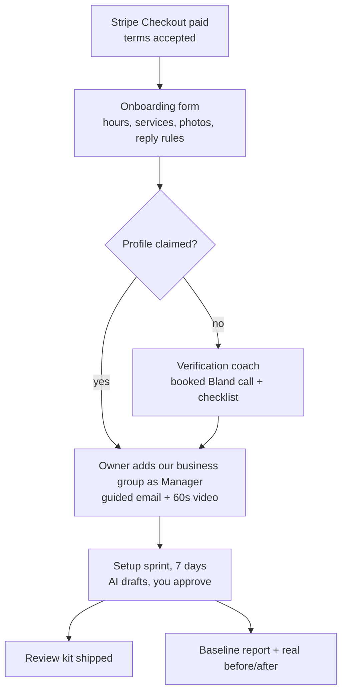

# Fulfillment

**Goal:** Setup finished within 7 days of getting access, then monthly work that runs on schedules. Clients spend about 5 minutes a month on it (sending photos and approving a few replies).

## 1. Onboarding (where deals are won or lost)

- **Onboarding form** (one page, 5 minutes). It collects:
  - the Google account email;
  - hours and holiday closures;
  - top services and prices (optional);
  - what makes them different (one sentence);
  - a photo upload, or permission to take photos from Instagram;
  - review reply rules: sign-off name; whether positive replies can be auto-posted; which topics to always escalate;
  - a contact for approvals (SMS or email).
- **Getting manager access:**
  - We send a one-click guide (GIF plus text).
  - Follow-ups go out automatically:
    - day 1: email;
    - day 2: SMS, if the client has agreed to texts;
    - day 3: a Bland call offer ("want me to walk you through it?").
  - At day 5 with no access, the case goes to you.
- **Unclaimed profiles:**
  - Google decides the verification method, often a video.
  - The coach call explains what to film:
    - the signage outside;
    - the inside of the premises;
    - tools or equipment;
    - proof of management (keys, the point-of-sale system).
  - The client does the verification themselves. We never verify on their behalf.
- **Success metric:** 80% of paid clients have given us access within 14 days. Refund anyone who can't get verified.

## 2. How we operate the profiles

| Phase | Tooling | Why |
|---|---|---|
| **Now (clients 0-60)** | White-label tool: Localo Pro, BrightLocal or Semrush Local, for posting, replies, reports and rank grids. Plus the GBP dashboard for setup. | No wait for API approval. About $2.50-5 per profile [S]. |
| **In parallel** | Create and verify our own agency GBP now. Build our site and a domain email. Apply for GBP API access. | Google reportedly requires a verified profile active for 60+ days [U]. |
| **After approval (target: month 3-4)** | Our own n8n + Claude workers calling the GBP APIs directly | Lower cost per client. Full control. Event-driven through Notifications (Pub/Sub). |

**GBP API map** (verified live on 2026-09-26):

| Job | API |
|---|---|
| Categories, description, hours, special hours, services, attributes | Business Information v1 `locations.patch` |
| Watch Google-suggested changes | Business Information `getGoogleUpdated` + Notifications `GOOGLE_UPDATE` |
| Posts (updates, offers, events) | v4 `localPosts` |
| Photos | v4 `media` / `media:startUpload` |
| Reviews and replies | v4 `reviews`, `reviews/{id}/reply` + Notifications `NEW_REVIEW` |
| Review link for the kit | Business Information metadata `newReviewUri` |
| Duplicate / suspension watch | Notifications `DUPLICATE_LOCATION`, `VOICE_OF_MERCHANT_UPDATED`; Verifications `getVoiceOfMerchantState` |
| Report data | Performance v1 (daily metrics + monthly search keywords) |
| Access | Account Management v1 admins + location groups |

## 3. Monthly calendar (runs automatically; you see exceptions only)

| When | Job | Agent | Human checkpoint |
|---|---|---|---|
| Daily | New reviews: draft replies. Positive ones are auto-posted if the client allowed it. Negative ones go to the client, with a copy to you. | Review responder | Client approves negative replies (you as fallback after 48 h) |
| Daily | Suggested edits, duplicates, suspension state | Guardian | You: any suspension or ownership conflict |
| Weekly (Monday) | Schedule this week's update post from the monthly plan | Fulfillment | None after the first month (plans are approved monthly) |
| Monthly (day 1) | Send the client a photo request with a shot list | Fulfillment | None |
| Monthly (day 3) | Draft next month's 4 updates. The client sees them in the report and can edit or veto within 3 days. | Fulfillment | Client (optional) |
| Monthly (day 5) | Report: Performance data, reviews, rank grid, plain-English summary, next steps | Reporter | You spot-check 10% |
| 2 weeks before holidays | Ask the client about holiday hours, then set special hours | Fulfillment | Client answers |
| Quarterly | Category re-check against competitors; spam competitor report; AI answer check (Grow) | Strategist | You approve any category change |
| Day 30 / 90 / renewal | Check-in call or email; offer add-ons | Account agent (Bland/email) | You: at-risk accounts |

## 4. Review engine (Grow; Keep gets the kit only)

**Inputs** (easiest first):
1. The business uploads or forwards a customer CSV once a week.
2. A Zapier or n8n connection to their booking or point-of-sale system (Square, Fresha, Shopmonkey, and similar) triggers a request after each visit.
3. "Text us the customer's number" (staff forward it).

**The message:**
- **Timing:** 2-24 hours after the visit.
- **Wording:** the same for everyone, for example: "Thanks for visiting Trattoria Olivo. Would you share a quick Google review? {link}".
- **Reminders:** at most one.

**Rules:**
- no gating, no incentives, no staff names;
- the list is sent at a steady pace, never all at once (Google restricts profiles with sudden review spikes since 2026-02);
- stop the moment a customer opts out.

**SMS compliance:**
- US texts need A2P 10DLC registration, and consent from customers the business collected [U].
- EU: the business needs a lawful basis to message its customers.
- Default to email where consent for texts is unclear. This belongs in the client terms and data processing agreement.

## 5. Review reply rules (the `review-reply` skill)

**Positive (4-5 stars):**
- thank them specifically (reference one detail);
- invite them back;
- sign with the owner's name;
- at most 60 words;
- no keywords stuffed in, no promotions.

**Negative (1-3 stars):**
- acknowledge, don't argue;
- take it offline (give a contact route);
- at most 80 words;
- **the owner always approves before posting.**

**Never:**
- disclose personal information or confirm that someone is a customer or patient (health businesses);
- offer compensation publicly;
- write replies that look copy-pasted (vary them per review).

## 6. Reporting (monthly, one page)

**Contents:**
- **Calls, directions and website clicks:** this month vs last month vs baseline.
- **The top 5 searches** people used to find them.
- **Reviews:** new this month, average rating, reply rate.
- **One rank grid image.**
- **What we did:** posts, photos, replies, fixes.
- **What's next.**

**Tone:** plain English, no jargon. Bad months are explained honestly (seasonality, a competitor surge).

**Delivery:** by email, as an HTML page plus a PDF (rendered with Playwright), and archived in the client portal.

## 7. Review kit logistics

- **Inventory:** blank acrylic stands with NFC chips, plus a label printer (or a print-on-demand card vendor).
- **Per client:**
  1. Generate the redirect link (`mpk.to/<slug>` → `newReviewUri`) and the QR code.
  2. Print the label and cards.
  3. Encode and lock the NFC chip (a phone app, about 30 seconds each).
  4. Ship.

  This can go to a virtual assistant or a fulfillment partner once you pass about 20 kits a month.
- **Redirect service:** a Cloudflare Worker plus a key-value store. It counts taps and scans for the report. **It is never switched off**, even after a client cancels.

## 8. Offboarding

1. Cancellation happens in the Stripe customer portal.
2. The agent sends a confirmation and a handover sheet.
3. We remove ourselves as Manager within 48 hours.
4. The redirect link stays live.
5. One exit-survey question: "What would have made you stay?". Answers feed the weekly review.
6. A win-back email goes out at 60 days (once only).
