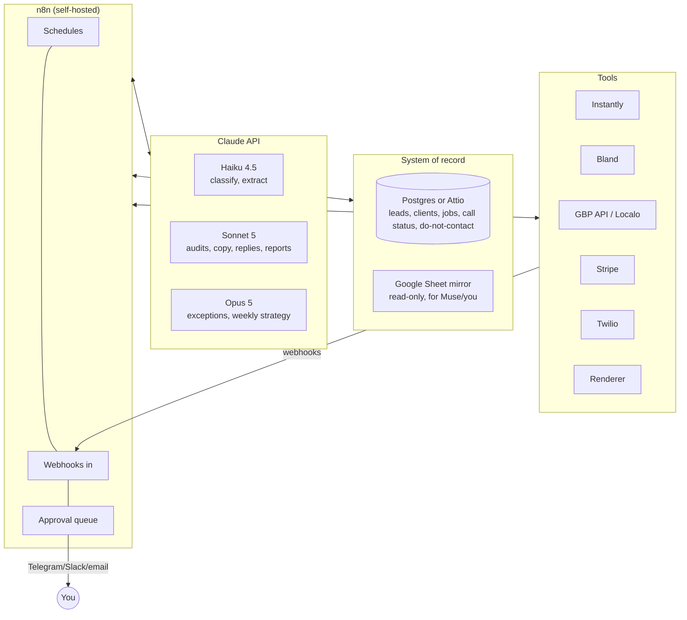

# AI operating model

**The operating model:** AI agents do the work, and you approve and handle exceptions. Every agent follows a playbook in `.claude/skills/<name>/SKILL.md`. Claude Code runs these playbooks today, and they are portable to Muse or any other agent that reads skill files.

## 1. Architecture

**Why n8n + the Claude API, and not one big autonomous agent:**
- **Business steps are fixed.** Deterministic pipelines handle them: every lead goes through the same checks (do-not-contact list, calling hours, caps).
- **Language models handle the language work:** writing, classifying, judging.
- **Everything is logged and repeatable.** Each job has an ID and can be safely re-run.
- **The cost is predictable.**

## 2. Agent roster

**Autonomy levels:**
- **A0:** you do it.
- **A1:** the agent drafts and you approve every item.
- **A2:** the agent acts; you get a daily digest and can reverse anything.
- **A3:** the agent acts; you see only exceptions.

| # | Function | Agent (skill) | Models / tools | Trigger | Start at | Graduate to | Promotion criteria |
|---|---|---|---|---|---|---|---|
| 1 | Prospecting | Prospector | n8n + Outscraper/DataForSEO + Haiku (website parsing) | Weekly per city and vertical | A1 (you approve cities, verticals and volume) | A2 | 4 clean weeks |
| 2 | Contact rules | Guard (code, not a model) | `config/markets.yaml` + do-not-contact list | Before every send or call | A3 | A3 | Code, with tests |
| 3 | Audit + proposal | Auditor (`gbp-audit`) | Sonnet 5 (Batch) + renderer | New qualified lead | A1 (100% of the first 50) | A3 (10% random + low-confidence cases) | ≤2% material errors |
| 4 | Email copy | Copywriter (`outreach-email`) | Sonnet 5 + Instantly API | Audit ready | A1 (templates) | A3 | Templates approved; spam and complaint rates within limits |
| 5 | Inbox | Triage (`reply-triage`) | Haiku 4.5 classify + Sonnet 5 draft | Reply webhook | A1 for replies; A3 for unsubscribes | A3 | 50 drafts approved without edits |
| 6 | Voice | Kit (Bland persona) | Bland pathways + tools | First call, follow-ups, walkthroughs, inbound, onboarding, check-ins | A2 (you review 10 transcripts a day) | A3 | 50 calls with no agent issues |
| 7 | Sales close | Closer | Stripe Checkout + webhooks | Checkout link clicked or paid | A3 | A3 | n/a |
| 8 | Onboarding | Coordinator | n8n + email/SMS + Bland | Payment received | A2 | A3 | 80% of clients give access within 14 days |
| 9 | Setup | Fulfiller (`gbp-audit` proposal reused) | Sonnet 5 + Localo / GBP API | Access granted | A1 (you approve each setup) | A2 | 20 setups with no rework |
| 10 | Monthly operations | Fulfiller | Same | Schedules (see [05](05-fulfillment.md)) | A2 | A3 | 2 clean months |
| 11 | Review replies | Responder (`review-reply`) | Sonnet 5 + GBP reviews API | New review | Positive A2, negative A1 (client) | Positive A3 | Client opts in |
| 12 | Protection | Guardian | Notifications + Verifications APIs | Event or daily check | A2 | A2 | Suspensions always reach you |
| 13 | Reporting | Reporter (`monthly-report`) | Sonnet 5 + Performance API + Playwright PDF | Monthly | A1 (first 2 months) | A3 (10% spot-check) | No corrections for 2 months |
| 14 | Support | Helpdesk | Sonnet 5 over email + Bland inbound | Inbound | A1 | A2 | 50 answers with no edits |
| 15 | Billing and dunning | Finance | Stripe Smart Retries + portal + Haiku | Stripe events | A3 | A3 | n/a |
| 16 | Retention | Account agent | Sonnet 5 + Bland check-ins | Day 30, day 90, usage drops | A2 | A2 | n/a |
| 17 | Chief of staff | Digest (Claude Code routine / Muse later) | Opus 5 over the database + inboxes | Daily 8:00, weekly Monday | A3 | A3 | n/a |

## 3. Your week (target: 5-15 hours)

| When | What | Time |
|---|---|---|
| Daily, about 20-30 min | Clear the approval queue (reply drafts, setups, negative-review escalations); read the digest | 2.5 h/week |
| Monday, 1 h | Weekly review: funnel, deliverability, churn risks, one thing to improve; approve next week's cities and volume | 1 h |
| As they come in | Warm-transferred calls, suspensions, unhappy clients, legal questions | 1-3 h |
| Monthly, 1 h | Report spot-check, pricing and offer changes, bookkeeping export | 1 h |
| **Early weeks** | Much higher: approving 100% of audits and replies while quality is proven | 10-15 h |

**The approval queue** is one Telegram or Slack channel (or email), with one message per item and buttons: Approve / Edit / Reject.
- An edit is saved as a new example for the skill, so the prompts improve as you go.
- Items not acted on within 48 hours escalate to the digest. Nothing sends silently while it waits for you.

## 4. Operating rules (enforced in code or prompts)

1. **Today's facts come from the data.** Audits quote listing fields as they are. The 90-day side comes from `projection.js`, so emails, calls and visuals quote the same numbers. The model marks uncertain audits `confidence: low`, which sends them to the queue.
2. **Calls:** leads marked `prior_approval`, `inbound` or `client`, inside each market's calling hours, at most 3 attempts per lead.
3. **Stop means stop,** across email, calls, SMS and mail, permanently.
4. **We post review replies, never reviews,** on client profiles. Negative-review replies wait for the owner.
5. **Money actions stay with you:** refunds, discounts and custom deals.
6. **Kill switch:** one n8n flag pauses all outbound (email, calls, mail). The Guard trips it automatically when email bounces go over 3%, complaints over 0.2%, or the call answer rate drops below 5% (numbers flagged as spam).

## 5. Data model (Muse-friendly)

**Lead record:** the schema is in `config/lead.schema.json`. Key fields:
- `lead_id`, `place_id`, `business_name`, `vertical`, `city`, `country`, `legal_form`
- `email`, `email_status`, `phone_e164`, `line_type`
- `consent_status` (`prior_approval`, `inbound`, `client`), `suppressed`
- `segment`, `health_score`, `priority`, `audit_token`, `stage`
- `last_email_thread_id`, `last_call_id`, `owner_notes`

**Principles:**
- One record per business, keyed by the Google place ID.
- Every channel writes an event (email sent, reply, page view, call, payment) to the same timeline.
- A nightly export writes CSV/JSON and mirrors it to a Google Sheet. This is how Muse (which has a built-in Google connector) or you in a spreadsheet can read the whole business.

## 6. "Working as Muse" today, and staying compatible

**What Muse does, and how this setup covers it now:**

| Muse capability | Covered today by |
|---|---|
| Research and planning | Claude Code + web research (this session) |
| Sub-agents in parallel | Claude Code subagents (6 ran research for this plan) |
| Scheduled background jobs | n8n schedules (production) + Claude Code routines (your digest and reviews) |
| Reacting to events | n8n webhooks (Instantly, Bland, Stripe, GBP Pub/Sub) |
| Email | Instantly for cold sends; the Gmail connector for your own inbox |
| Phone calls and texts | Bland API or Bland's MCP server; Twilio |
| Skills | `.claude/skills/*/SKILL.md` in this repo |
| Memory and files | The database + this repo + the Sheet mirror |

**Compatibility checklist** (built into the plan):

1. **Every Bland call goes through one module** that calls `POST /v1/calls` with a `pathway_id` (or persona), a `webhook`, and our IDs in `metadata`. Nothing is hardcoded in prompts. Muse could make the same call with a shared API key.
2. **Separate Bland keys:** production outbound, and a spare, limited "operator" key you could give to Muse.
3. **Playbooks are `SKILL.md` files** with `name` and `description` front matter. Muse reportedly loads skills in the same format (low confidence; unconfirmed).
4. **Email templates are plain Markdown.** Every thread ID is logged.
5. **One shared do-not-contact list** that every agent (and Muse) checks first.
6. **The system of record exposes a small REST API** with API-key login and an OpenAPI description. Muse can build a custom connector from API docs.
7. **Schedules live in one config;** jobs can be re-run safely.
8. **Don't depend on unconfirmed Muse features:** MCP support, the skills folder path, pricing caps.

**Where Muse could fit later:**
- as **your** operator console: "What's in my approval queue?", "Call Dana at Ember & Oak about her renewal";
- **not** as the campaign engine. Its phone plan is one call at a time and 500 calls a day, and the same calling laws apply.

## 7. Cost of the AI layer (per month)

| Item | Pilot (500/week) | Scale (1,000/week) |
|---|---|---|
| Claude API (Sonnet on Batch for audits and copy, Haiku for triage, Opus for exceptions) | ~$40-60 | ~$60-120 |
| Bland (Start plan, ~60-150 calls) | ~$35-85 | ~$85-170 |
| n8n VPS | ~$10-20 | ~$10-20 |
| Rendering (Cloudflare Browser Rendering) | ~$5 | ~$5 |
