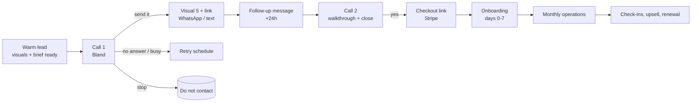

# Sales playbook: from warm lead to renewal (US and Malaysia)

This walks through the whole sales process in order: what the bot prepares, what goes out first, every scenario and what happens next, how the deal closes, and what happens after the client pays.

Message templates are in [outreach/messages/](../outreach/messages/):
- [my-whatsapp.md](../outreach/messages/my-whatsapp.md): Malaysia, in English, Malay and Chinese.
- [us-text-email.md](../outreach/messages/us-text-email.md): US.

Call flows are in [outreach/voice/call-flows.md](../outreach/voice/call-flows.md).

## 1. The warm lead: what the bot prepares before anyone is called

The bot is Claude Code running the `warm-pipeline` skill. A lead is **warm** when all of these exist:

| Item | What it is | Used for |
|---|---|---|
| Listing facts | Rating, review count, categories, hours, website, photos, claim status, recent reviews, rank for the search | Call opener, findings |
| Score and segment | 0-100 score; unclaimed / behind on reviews / neglected | Which opener and angle to use |
| 3 findings | Plain-language gaps: "no hours on Google", "0 replies to 27 reviews" | First 20 seconds of the call |
| Competitors | The 3 businesses Google ranks above them | "Kopi Kaki SS2 has 418 reviews, you have 27" |
| 90-day projection | Reviews, rating, photos and score in 90 days | "About 117 reviews in 90 days" |
| **Visual 5** (two phones, portrait) | Their profile today and in 90 days | Sent on WhatsApp / text right after the call |
| **Visual 9** (swipe) | One profile split between today and 90 days | Email, link preview, top of the audit page |
| Audit page | Full proposal: categories, description, services, posts, sample reply | The link in every message |
| Call brief | `request_data` for Bland: name, numbers, findings, competitor, price | Personalizes the call |
| Best time and language | Calling window per market; English, Malay or Chinese | When and how Kit calls |

**Daily targets:**
- about 150 ready leads per market, one working week of calls at pilot volume;
- the bot tops the pool up every morning.

## 2. Outreach materials (the kit)

| Material | US | Malaysia |
|---|---|---|
| First touch | Bland call (English) | Bland call (English, Malay or Mandarin) |
| Visual after a "yes" | Visual 5 by text if they asked for text, otherwise email with Visual 9 | Visual 5 on WhatsApp, with the audit link |
| Follow-up channel | Text (if they agreed) or email | WhatsApp |
| Voicemail | English | Their language |
| Audit page | English | Their language (en / ms / zh) |
| Price | Keep $99/mo, Grow $179, setup $149 waived | Keep RM199/mo, Grow RM399, Premium RM699, setup RM390 waived |
| Guarantee | Month to month, 14-day money back | Month to month, 14-day money back |

**Rule for the first message after a call:** send it while they are still on the line, or within 60 seconds. The "yes, send it" moment is the warmest the lead will ever be.

## 3. The sequence

### US

| Day | Touch | Content |
|---|---|---|
| 0 | **Call 1** (`first_call`) | Hook with their numbers, then ask "who looks after your Google profile?", then offer the visual |
| 0 | Text or email (on "yes") | Visual 5 (text) or Visual 9 (email) + audit link + price |
| 1 | Message | "Did it come through? The page shows exactly what we'd change." |
| 2 | **Call 2** (`follow_up`) | "What did you think?", then objections, then the close |
| 5 | Email | Visual 9 + one line about the review gap against a named competitor |
| 7 | **Call 3** (`walkthrough_close`), engaged leads only | Walk through the page, then close |
| 14 | Final message | "Should I close your file? The page stays up until [date]." |

### Malaysia

| Day | Touch | Content |
|---|---|---|
| 0 | **Call 1** (`first_call`) | Same flow, in the owner's language |
| 0 | WhatsApp (on "yes") | Visual 5 + audit link + price |
| 1 | WhatsApp | "Sampai tak? / Did it come through?" + one line on what changes first |
| 3 | **Call 2** (`follow_up`) | Reaction, objections, close |
| 7 | WhatsApp | Visual 9 or the review-growth chart + "want us to start this week?" |
| 10 | **Call 3**, engaged leads only | Walkthrough and close |
| 21 | Final WhatsApp | Close the file politely |

**Event triggers override the calendar:**
- **Audit page opened:** call within 2 hours, inside the calling window.
- **Reply with a question:** answer within 5 minutes, then offer a call.
- **"Stop" anywhere:** end everything.

**Calling hours:**
- **US:** Tue-Thu, 09:00-18:00 local.
- **Malaysia:** Mon-Fri, 10:00-11:30 and 15:00-17:30, never Friday 12:00-15:00. In Kedah, Kelantan and Terengganu the weekend is Friday and Saturday.

## 4. Every scenario and what happens next

Kit's lines are in [call-flows.md](../outreach/voice/call-flows.md) and [persona.md](../outreach/voice/persona.md). The template IDs below (M1, M2…) are in the message files.

### Call outcomes

| # | Scenario | What Kit does | What gets sent | Next step | Stage |
|---|---|---|---|---|---|
| S1 | No answer | Hang up (no voicemail on attempt 1) | Nothing | Retry at a different time of day next window; 3 attempts max over 7 days | `called` |
| S2 | Voicemail (attempt 2 or 3) | Leave the localized voicemail | Nothing (no opt-in yet) | Next attempt per schedule | `called` |
| S3 | Staff / gatekeeper | "Is the owner around? It's about the shop's Google listing." Get the best time; no pitch | Nothing | Callback at that time | `callback` |
| S4 | Owner, busy | "When's better?" | Nothing | Callback at their time | `callback` |
| S5 | Owner, curious: "send it" | Confirm the channel (WhatsApp / text / email) | **M1** visual 5 + link + price | M2 at +24h, call 2 at +48h (US) / +72h (MY) | `visual_sent` |
| S6 | Owner, ready: "how much / let's do it" | Price, guarantee, "I'll send the link now" | **M5** checkout link + visual | Payment watch; reminder at +4h and +24h | `checkout_sent` |
| S7 | "Need to think / ask my partner" | "Of course. I'll send it so you can show them." | M1 | Call 2 at their chosen time (default +2 days) | `visual_sent` |
| S8 | "Already have someone" | "Happy with how it's going?" If yes, offer the page to share | M1 (as a gift) | Nurture in 90 days | `nurture` |
| S9 | "I do it myself" | "Then you know the work. We do it weekly so you don't have to." | M1 | Nurture in 60 days | `nurture` |
| S10 | "Too expensive" | One reframe: "one extra customer a month"; setup waived; 14-day money back | M5 or M1 | Call 2; allowed concession: first month at 50% (founder approval) | `visual_sent` |
| S11 | "Is this Google? / Scam?" | "No, we're Mapkeeper, an independent team. I'll send our page so you can check us." | M1 + company link | As S5 | `visual_sent` |
| S12 | Not interested, polite | "No problem. Can I ask what would make it useful?" Log the reason | Nothing | Nurture in 120 days, once | `closed_lost` |
| S13 | Stop / hostile | "Understood, you won't hear from us again." | Nothing | Do-not-contact, permanent | `dnc` |
| S14 | Wrong number / closed | Apologize, end | Nothing | Mark invalid | `invalid` |
| S15 | Unclaimed profile, interested | "We'll help you claim it; it takes about 10 minutes." | M1 + claim guide | Book `onboarding_verification`; sell after the claim | `claim_help` |
| S16 | Asks for a person | Transfer during your hours, otherwise book | Booking link | Founder call | `founder` |
| S17 | Prefers another language (MY) | Switch pathway language, or offer a callback in Malay / Mandarin / Cantonese | Nothing | Callback with the right voice or a human | `callback` |
| S18 | "WhatsApp me the details" (MY) | Confirm the number is on WhatsApp | M1 on WhatsApp | As S5 | `visual_sent` |

### Message outcomes (after the visual was sent)

| # | Scenario | Reply within 5 min | Next step |
|---|---|---|---|
| R1 | "Nice / looks good" | **M4**: "Want us to start this week?" + checkout link | Call if no payment in 24h |
| R2 | A question about the service | Answer in two lines + offer a 5-minute call | Call at their time |
| R3 | "How much?" | **M3** price + what's included + link | Payment watch |
| R4 | "Later / next month" | **M6**: "I'll check in on [date]" | Scheduled reminder |
| R5 | "Is this real / how did you get my number?" | "From your Google listing; happy to remove you anytime." | As R2 |
| R6 | Silence after M1 and M2 | Call 2, then M7 at day 7, then M8 at the end | Nurture |
| R7 | "Stop" | Nothing; do-not-contact | Permanent |
| R8 | Voice note (MY) | Transcribe it, answer by text, offer a call | As R2 |

## 5. Closing

**The close question** (call or message):
> "Want me to send the link so we can start this week?"

Ask it once in the call, and once more after handling one objection. Never a third time.

**Payment**

| | US | Malaysia |
|---|---|---|
| Link | Stripe Checkout, pre-filled with business name and email | Stripe Checkout (card, FPX online banking, GrabPay) [U: confirm methods on your Stripe MY account] |
| Invoice route | Stripe invoice for multi-location | Stripe invoice with FPX for owners who want a bank transfer |
| Terms | Clickwrap on checkout: month to month, 14-day money back, you stay the owner | Same, in English and Malay |

**The moment they pay** (automatic):
1. Welcome message with a 5-minute onboarding form and the Google invite guide (**M9**).
2. The lead record becomes a client. The pipeline stops all sales touches.
3. Setup call booked (optional) with Kit's `onboarding_verification` flow.
4. You get one line in your daily digest: "New client: Kopitiam Seri Mawar, RM199/mo".

**Payment not completed:**
- **+4h:** a reminder with the link.
- **+24h:** a Kit call: "Anything stopping you?"
- **+72h:** back to follow-up.

## 6. Onboarding: days 0 to 7

| Day | Step | Who |
|---|---|---|
| 0 | Welcome message + form: hours, public holidays they close, services and prices, "send us 10 photos on WhatsApp", reply sign-off name, which reviews they want to approve | Bot |
| 0-2 | Google access: they add us as Manager (guide + 60-second video) | Client, nudged by bot |
| 0-2 | If unclaimed: verification coach call. Most new Malaysian profiles need video verification; film the signboard, the inside, the equipment, and proof of running it | Kit (`onboarding_verification`) |
| 2-5 | Setup sprint (below) | Bot, you approve |
| 3 | Review kit shipped: stand + 100 cards (MY: J&T or Pos Laju; US: USPS) | You or a helper |
| 7 | "You're live" message with the **real** before/after screenshots, the same layout as the sales visual | Bot |

**Setup sprint checklist** (the `gbp-audit` proposal becomes real):
1. Primary and secondary categories.
2. Description, services or menu with prices.
3. Hours, including state and public holidays (MY) or US holidays.
4. Photos: 20 from the owner's WhatsApp (best first), cover photo chosen.
5. Replies to the review backlog (negative reviews wait for owner approval).
6. First post (from the proposal's update ideas).
7. Website or booking link, WhatsApp or call button where available.
8. US only: Apple Business Connect and Bing Places mirrored.
9. Baseline recorded: rating, review count, calls, directions and clicks from Google's Performance data.

## 7. Operations after the sale

**The client's job:** about 5 minutes a month (photos, approving negative-review replies).

| Rhythm | What happens | Who |
|---|---|---|
| Daily | New reviews: positive answered automatically in their voice; negative sent to the owner on WhatsApp for "approve / edit" | Bot (`review-reply`), owner approves negatives |
| Daily | Watch for Google-suggested edits, duplicates, suspension | Bot |
| Weekly | One post (offer, menu item, event, holiday hours) | Bot |
| Weekly | Review engine: stand + cards + a thank-you message with the review link sent to customers the owner shares | Bot + owner |
| Monthly (day 1) | Photo request on WhatsApp with a shot list | Bot |
| Monthly (day 5) | Report: calls, directions, website clicks, new reviews **against the 90-day projection**, next month's plan | Bot (`monthly-report`), you spot-check |
| Day 30 / 60 / 90 | Check-in call: changes, photos, satisfaction 1-5; 3 or below goes to you | Kit (`client_checkin`) |
| Day 90 | "90 days ago vs. today" visual: the real result against the promise | Bot |
| Quarterly | Category re-check against competitors; spam competitors reported; upsell (Grow / Premium, photo shoot, extra stand, second location) | Bot proposes, you approve |

**Behind projection at day 45** (reviews under 50% of the plan):
- Send the owner a 3-point fix: stand position, staff pointing at it, cards in bags.
- Increase follow-up messages.
- Tell them honestly.

**Billing:**
- Stripe renews monthly.
- Failed payment: Stripe retries, plus a WhatsApp or text reminder on day 1, a call on day 5, and a pause on day 14.

**Cancellation:**
1. One save attempt: pause for a month, or downgrade.
2. Then cancel cleanly.
3. Remove ourselves as Manager within 48h and send a handover note.
4. The review stand keeps working.

**Support:**
- **Malaysia:** the same WhatsApp number.
- **US:** the phone number answered by Kit (`inbound_line`).

Anything unclear goes to you with the thread.

## 8. Who does what

| Step | Bot (Claude Code) | Bland (Kit) | You |
|---|---|---|---|
| Find and prepare leads | ✔ `warm-pipeline` | | Pick areas and verticals weekly |
| Calls 1-3, voicemail, callbacks | Queues them | ✔ | Take transfers |
| Visual + messages | ✔ sends M1-M8 | Triggers them | |
| Replies to messages | ✔ drafts; sends standard ones | | Approve unusual ones |
| Close | Sends checkout, watches payment | Asks for the yes | Discounts, multi-location |
| Onboarding | ✔ form, guide, setup sprint | Verification coach call | Approve each setup (first 20) |
| Monthly operations | ✔ posts, replies, reports | Check-in calls | Spot-check, negative reviews |
| Retention | ✔ flags risk, proposes upsell | Check-ins | Save calls |

## 9. Numbers to watch (per market, weekly)

| Stage | Metric | Pilot target |
|---|---|---|
| Pipeline | Warm leads ready | ≥ 150 |
| Calls | Owner reached (any of 3 attempts) | ≥ 30% |
| Calls | Visual accepted ("send it") | ≥ 35% of owners reached |
| Messages | Reply to M1/M2 | ≥ 25% |
| Close | Paid within 14 days of the visual | ≥ 8% of visuals sent |
| Onboarding | Google access within 7 days | ≥ 80% |
| Operations | Reviews at day 90 vs. projection | ≥ 70% of plan |
| Retention | Month-3 churn | < 6%/month |

## 10. Your daily and weekly routine

- **Daily, 20 minutes:**
  - read the digest (new clients, hot leads, transfers you missed);
  - approve unusual replies and negative-review replies;
  - listen to 5 random call recordings.
- **Weekly, 1 hour:**
  - funnel numbers;
  - the one change to test next week (opener, price framing, visual choice);
  - next week's areas and verticals.
